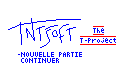

# The T-Project

An adventure game running on [Casio Graph 65](https://fr.wikipedia.org/wiki/Casio_CFX-9960GT) (CFX-9960GT).

First released on 15th december 2001, it has been recently dusted and ported to monochrome calculators (Casio Graph [35+](https://fr.wikipedia.org/wiki/Casio_Graph_35%2B) & [100+](https://fr.wikipedia.org/wiki/Casio_Graph_100%2B)).

[Instructions](./doc/notice.md) are available in french.

# Limitations

The game requires 64kB of memory to run (47kB of programs, 1 picture, 2-3 matrices and lists).

# Packages

- [TPROJECT.CAT](./packages/TPROJECT.CAT) for graph65 (3 colors)
- [TPROJECT35.CAT](./packages/TPROJECT35.CAT) for graph35+ (monochrome)
- [TPROJECT100.CAT](./packages/TPROJECT100.CAT) for graph100+ (monochrome)

# Contact

tntsoft@fastmail.com

# Backlog

- [x] 1st dialog : clarify with "tiens, prends cet argent pour etc."
- [x] Fix typo "scull" in user menu
- [x] Dynamic step to display score
- [x] User menu : remove 'options', 'retour', 'quitter le jeu'
- [x] ~~Suggest to load a game if a save exists~~ → impossible
- [x] Fix dialogs typos
- [x] ~~Facilitate the arm wrestling against the troll~~ → not necessary (on graph65)
- [x] Enable F6 key (go to world) during city loading
- [x] Objects : do not display 'Epee' and 'Livre'
- [x] Objects : remove menu entry [jeter]
- [x] Shop : Enable [exit] key to exit shop
- [x] Objects : allow to take several objects in a row, except during fight : Not r, TNT9
- [ ] Check if we can use pict-2 to store last visited city. probably requires 4096 bytes saving elsewhere
- [x] ~~Check if 'vision' power exists~~ → it does
- [x] ~~Extract shop init from TNT15~~ → TNT16
- [x] ~~Extract hostel from TNT4~~ → TNT17
- [x] ~~Extract life gauge from TNT1~~ → TNT18
- [x] ~~Display 'hum?' only if progress < W ?~~ no
- [ ] Optimize `Mat Z[12,6]→X` in TNT13
- [x] Port to graph35+/graph100+
    - [x] remove ':' separators
	- [x] monochrome
		- [x] modify menus using [    ] brackets to select entries
		- [x] life gauge in cities
		- [ ] make dialogs speaker explicit
	- [ ] ¥ not rendered with `Text` command
	- [x] factorize sleep loops into Prog "T0" + use a global sleep factor
- [x] Simplify cat encoding : Re, Ra, E, r, or, a, an, milli, Cnt, etc.
- [x] Fix exit from shop without checking progress
- [ ] Display progress in user menu
- [ ] Fix blinking screen around progress 9 when searching for gems in botma (on G35+)
- [ ] Fix 'aprend' menu dash, one pixel too far
- [x] Notice in markdown/pdf
	- [x] screenshots of attaks/powers
	- [x] 'hum?' in points of interest
	- [x] sequence diagram for TNT2 (main loop)
	- [x] sequence diagram for TNT3 (city loop)
	- [x] sequence diagram for TNT14 (fight loop)
	- [ ] Add progress help in notice
	- [x] Locate cities in notice
