
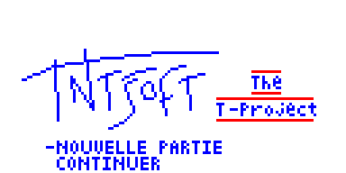

# The T-Project

Petite planète perdue dans une dimension anonyme, Gaïa a la particularité de porter en son cœur un incroyable flux
d'énergie utilisé par ses habitants sous forme de magie. Celle-ci provoqua de nombreux conflits entre les humains et
la faune qui peuple Gaia. De cette soif de pouvoir omniprésente naquit une organisation mystérieuse, la FFC°, qui
parvint rapidement à écraser ses opposants et à régir Gaia tout entière. Seuls ses plus hauts dirigeants savent qu'elle
fut créée pour réaliser un projet démentiel : la conquête du Pouvoir, dont la clé est enfouie à des kilomètres sous
terre sous la forme d'un démon endormi…

- Diamètre de Gaia : 5480 Km
- Satellites : Eryan, Soltar
- Température moyenne : 28°C
- Monnaie : le Skull

## Carte du monde

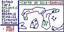

Déplacez-vous sur la carte avec les touches directionnelles. Vous pouvez appuyer sur `[MENU]` a tout moment pour consulter vos objets ou vos stats.

## Villes

Les villes qui vous sont accessibles sont représentées par un point orange sur la carte ; leur liste figure sur la gauche. Avancer dans le scénario vous permettra de découvrir de nouvelles villes.

Sur chaque continent se trouve un héliport. Ils vous permettront de vous déplacer très rapidement, sans vous faire attaquer, et présentent l'avantage non négligeable d'être gratuits.

Déplacez-vous dans les villes avec les touches directionnelles. Vous pourrez rencontrer des personnages dans les maisons ou, parfois, dans les rues.

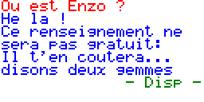

Pressez `[MENU]` pour consulter vos stats ou utiliser un objet.

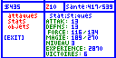

Pressez `[F6]` pour sortir de la ville et retourner sur la carte du monde.

Les villes sont agrémentées d'éléments de décors : arbres, rochers, eau, etc.

Un  vous signale la présence d'une auberge, vous pourrez y sauvegarder la partie (gratuitement). Elles vous permettront également de vous reposer pour la modique somme de 25 skulls, ce qui aura pour effet de remonter vos stats à leur maximum.

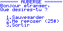

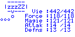

Un  vous signale la présence d'un magasin. Vous en trouverez dans les villes, mais aussi sur le monde de temps en temps, sous la forme de marchands ambulants. Achetez-y tous les objets dont vous aurez besoin ; les prix varieront selon les magasins. Attention : certains objets ne sont pas en vente dans les magasins, comme les groseyes par exemple.

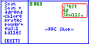

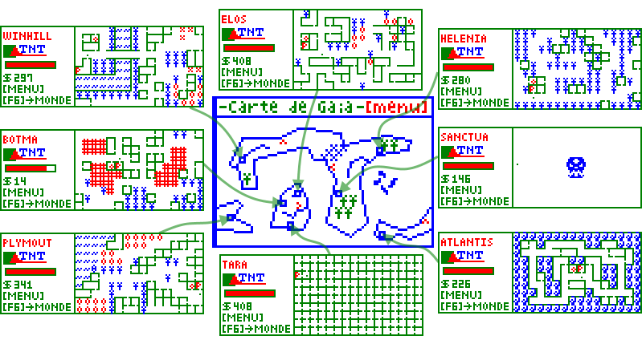

## Combats

### Les monstres

Vous rencontrerez des monstres en vous déplaçant à pied sur Gaia. Vous pourrez les fuir, mais les combattre peut vous apporter beaucoup : amélioration des stats, objets, expérience, argent…

|  |  |  |  |
|:-:|:-:|:-:|:-:|
| 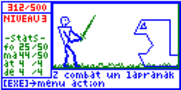 | 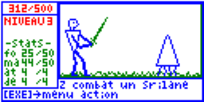 | 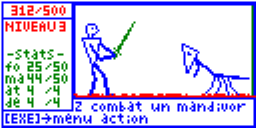 | 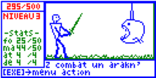 |
| 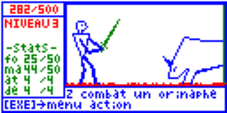 | 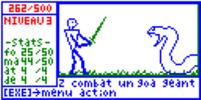 | 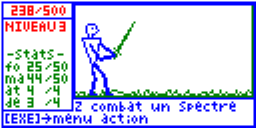 |  |

### Apprendre
Utilisez cette action chaque fois que l'ennemi utilise une attaque ou un sort que vous ne maîtrisez pas encore. Cela vous permettra d'apprendre instantanément ce coup, et de le réutiliser pendant les combats. Vous ne pouvez mémoriser que 5 attaks et 5 sorts : il vous faudra donc rapidement en supprimer pour pouvoir en apprendre de nouveaux.

### La fuite
Mourir l'épée au poing, c'est mourir quand même. La fuite n'est pas un déshonneur.

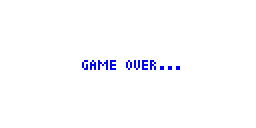

### Mecanique des combats

- Le niveau de Z augmente avec le nombre de victoires
- Une montée de niveau augmente les stats (att, def, vie, force, magie)

### La fin du combat
Si vous sortez victorieux du combat, vous remporterez :

- Des points d'expérience, qui vous permettront de passer vos niveaux de combattant
- Une récompense pour tout monstre tué sur Gaia
- Des objets divers
- Des améliorations progressives de vos statistiques

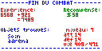

**Note** : toutes les améliorations, expérience, récompenses ou objets trouvés sont proportionnels à la force du monstre.

## Attaks

Chaque attak coûte des points de force, que vous pourrez récupérer avec l'objet **adrena**, ou en dormant.

Les attaks sont au nombre de 8 :

| id | Nom | Coût (force) | Effet | 👁 |
|:---|:----|:---------------:|:------|:--:|
| 1 | coup | 1 | Inflige des dommages à l'ennemi | 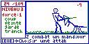 |
| 2 | garde | 1 | Augmente la défense | 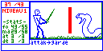 |
| 3 | feinte | 1 | Diminue la défense de l'ennemi | 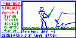 |
| 4 | tranch | 2 | Inflige des dommages à l'ennemi | 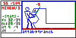 |
| 5 | double | 3 | Inflige des dommages à l'ennemi | 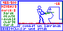 |
| 6 | charge | 5 | Inflige des dommages à l'ennemi et à soi | 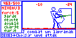 |
| 7 | furie | 6 | Inflige des dommages à l'ennemi | 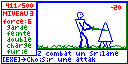 |
| 8 | Xmeta | 9 | Inflige des dommages a l'ennemi | 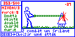 |

## Sorts

Chaque sort coûte des points de magie, que vous pourrez récupérer avec l'objet **chlore** ou en dormant.

Attention si votre niveau de magie est trop faible pour un sort vous ne pourrez pas l'utiliser.

Vous pourrez en apprendre 17 sorts différents :

| id | Nom | Coût (magie) | Effet | 👁 |
|:---|:----|:---------------:|:------|:--:|
| 1 | acier | 1 | Augmente la défense | 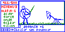 |
| 2 | force | 1 | Augmente l'attaque | 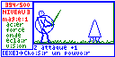 |
| 3 | onde | 1 | Inflige des dommages à l'ennemi | 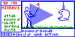 |
| 4 | eclair | 2 | Inflige des dommages à l'ennemi | 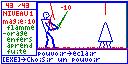 |
| 5 | vision | 1 | Affiche les stats de l'ennemi | 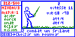 |
| 6 | boost | 4 | Augmente l'attaque et la défense | 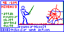 |
| 7 | vague | 4 | Inflige des dommages à l'ennemi | 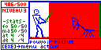 |
| 8 | morsur | 5 | Inflige des dommages à l'ennemi et diminue son attaque | 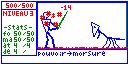 |
| 9 | griffe | 5 | Inflige des dommages à l'ennemi et diminue sa défense | 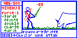 |
| 10 | soleil | 5 | Inflige des dommages à l'ennemi et à soi | 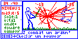 |
| 11 | vital | 6 | Soigne | 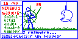 |
| 12 | onde+ | 6 | Inflige des dommages à l'ennemi | 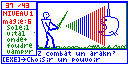 |
| 13 | foudre | 7 | Inflige des dommages a l'ennemi | 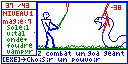 |
| 14 | vampyr | 8 | Inflige des dommages à l'ennemi et soigne | 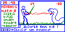 |
| 15 | flamme | 9 | Inflige des dommages à l'ennemi | 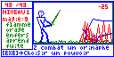 |
| 16 | orage | 10 | Invoque les dieux d'Aasgard | 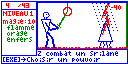 |
| 17 | enfers | 12 | Invoque les dieux infernaux | 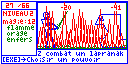 |

## Objets

Vous pourrez utiliser un objet en allant dans « objets » dans le menu, ou en choisissant « objets » pendant un combat.

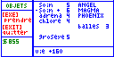

Très utiles pendant les combats, ils vous serviront à régénérer vos points de vie, de force ou de magie, ou à attaquer l'adversaire.

Voici les différents objets que vous pourrez trouver, après un combat ou dans un magasin :

| id | Nom | Coût | Effet | 👁 |
|:---|:----|:----:|:------|:--:|
| 1 | soin | 16~24$ | vie +80 | |
| 2 | soin+ | 21~28$ | vie +160 | |
| 3 | adrena | 40~50$ | force +40 | |
| 4 | chlore | 45~55$ | magie +40 | |
| 5 | protec | 90~140$ | def +1 de façon permanente | |
| 6 | power+ | 100~150$ | att +1 de façon permanente | |
| 7 | groseye | - | Objet particulièrement magique et doté d'une puissance monstrueuse (130~170 PV) | 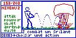 |
| 11 | ANGEL prisme de glace requiert 20pts de magie | 0→magie | +3 inertie ennemi, dommages ennemi proportionnels à magie | 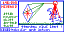 |
| 12 | MAGMA prisme de feu requiert 20pts de magie | 0→magie | att -2, def -2, dommages ennemi proportionnels à magie | 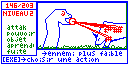 |
| 13 | PHOENIX prisme de vie requiert 20pts de magie | 0→magie | vie Z +2*magie, dommages ennemi proportionnels à magie | 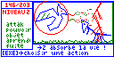 |
| 14 | fusil | 160~200$ | Inflige des dommages à l'ennemi en combat (vie -16~23) ⚠️ pas d'effet sur les spectres | 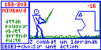 |
| 15 | balles | 3~6$ | Munitions du fusil |  |

 
Pour toute question, contactez TNTsoft@fastmail.com

TNTsoft vous souhaite un agréable voyage sur Gaia.
 

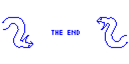

